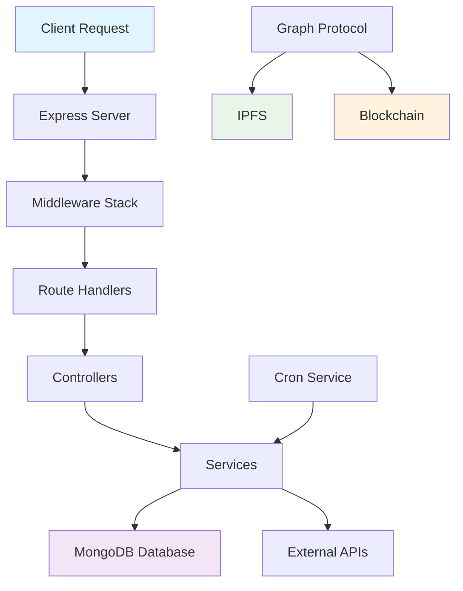
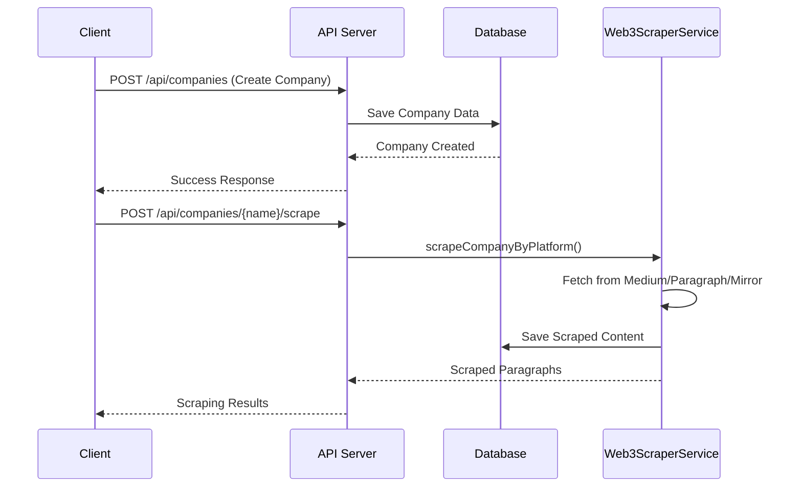
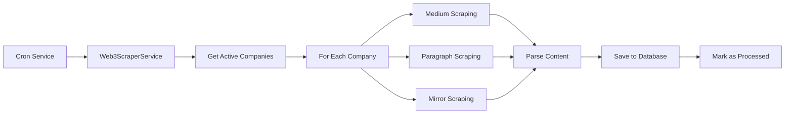
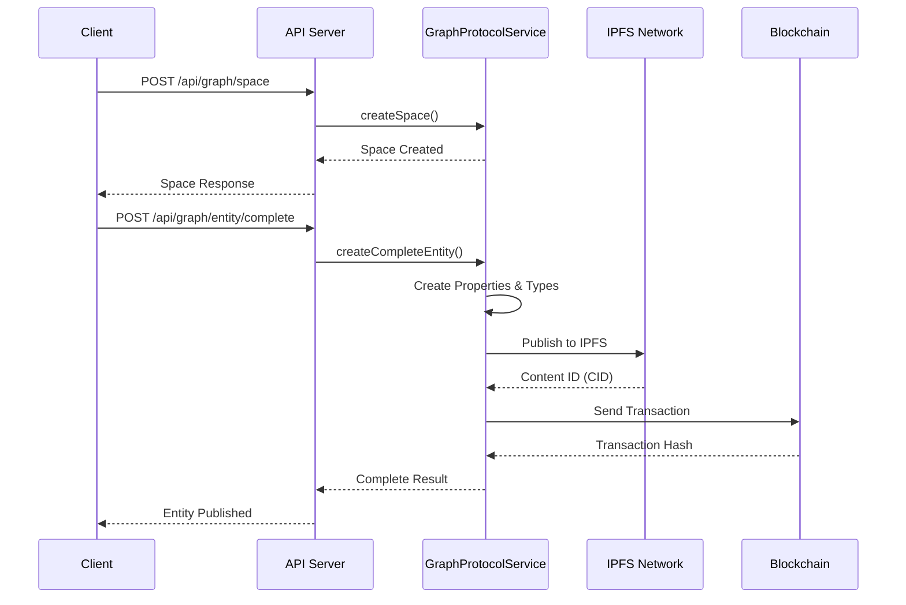

# Hackthon Backend Server

A comprehensive backend server built with Node.js, TypeScript, Express, MongoDB, and Graph Protocol integration for Web3 content scraping and management.

## 🚀 Features

- **Modern Stack**: Node.js, TypeScript, Express.js with full type safety
- **Database**: MongoDB with Mongoose ODM and optimized indexing
- **API Documentation**: Interactive Swagger/OpenAPI documentation
- **Web3 Integration**: Content scraping from Medium, Paragraph.xyz, and Mirror.xyz
- **Graph Protocol**: Full integration with Graph Protocol for blockchain data management
- **Security**: Helmet, CORS, rate limiting, and input validation
- **Automation**: Scheduled content fetching with cron jobs
- **Architecture**: Clean, scalable, and well-documented codebase

## 📋 Prerequisites

- Node.js (v16 or higher)
- MongoDB (local or cloud instance)
- npm or yarn

## 🛠️ Installation

1. **Clone the repository**

   ```bash
   git clone <repository-url>
   cd server
   ```

2. **Install dependencies**

   ```bash
   npm install
   ```

3. **Environment Setup**

   ```bash
   cp env.example .env
   ```

   Update the `.env` file with your configuration:

   ```env
   PORT=3000
   NODE_ENV=development
   MONGODB_URI=mongodb://localhost:27017/hackthon_db
   JWT_SECRET=your_jwt_secret_here
   JWT_EXPIRES_IN=7d
   CORS_ORIGIN=http://localhost:3000
   TWITTER_ENABLED=false
   CRON_ENABLED=true
   CRON_SCHEDULE=0 */6 * * *

   # Graph Protocol Configuration
   ADDRESS=your_ethereum_address
   PRIVATE_KEY=your_private_key
   ```

4. **Start MongoDB**
   - Local: Ensure MongoDB is running on your system
   - Cloud: Update `MONGODB_URI` in `.env` with your cloud connection string

## 🏃‍♂️ Development

### Start Development Server

```bash
npm run dev
```

### Build for Production

```bash
npm run build
npm start
```

### Other Scripts

```bash
npm run lint          # Check code quality
npm run lint:fix      # Fix linting issues
npm test             # Run tests
```

## 📚 API Documentation

Once the server is running, visit:

- **Swagger UI**: http://localhost:3000/api-docs
- **Health Check**: http://localhost:3000/health
- **API Root**: http://localhost:3000/

## 🔄 Application Flow

### 1. System Architecture



### 2. Company Management Flow



### 3. Content Scraping Flow



### 4. Graph Protocol Integration Flow



## 📊 API Endpoints

### Company Management

- `GET /api/companies` - Get all companies with pagination
- `GET /api/companies/:id` - Get specific company
- `POST /api/companies` - Create new company
- `PUT /api/companies/:id` - Update company
- `DELETE /api/companies/:id` - Delete company

### Content Scraping

- `POST /api/companies/:companyName/scrape` - Scrape content for company
- `GET /api/companies/:companyName/paragraphs` - Get company's scraped content
- `PATCH /api/companies/:companyName/paragraphs/:id/process` - Mark content as processed

### Graph Protocol

- `POST /api/graph/space` - Create Graph Protocol space
- `POST /api/graph/entity` - Create entity
- `POST /api/graph/entity/complete` - Create complete entity with properties
- `POST /api/graph/publish-complete` - Publish to IPFS and blockchain
- `POST /api/graph/full-flow` - Demo complete Graph Protocol flow

## 🗂️ Project Structure

```
src/
├── config/                 # Configuration files
│   ├── database.ts        # MongoDB connection setup
│   ├── env.ts             # Environment variables
│   └── swagger.ts         # API documentation config
├── controllers/           # Route controllers
│   └── companyController.ts
├── middleware/            # Custom middleware
│   ├── asyncHandler.ts   # Async error handling
│   ├── errorHandler.ts   # Global error handler
│   └── notFound.ts       # 404 handler
├── models/               # Mongoose models
│   ├── Company.ts        # Company data model
│   ├── Paragraph.ts      # Scraped content model
│   └── Tweet.ts          # Twitter data model
├── routes/               # Express routes
│   ├── companyRoutes.ts  # Company management routes
│   └── graphProtocolRoutes.ts # Graph Protocol routes
├── services/             # Business logic services
│   ├── cronService.ts    # Scheduled tasks
│   ├── web3ScraperService.ts # Content scraping
│   └── graphProtocol.ts  # Graph Protocol integration
├── utils/                # Utility functions
│   ├── logger.ts         # Logging utility
│   └── urlCleaner.ts     # URL processing
└── server.ts             # Main server file
```

## 🔧 Data Models

### Company Model

```typescript
{
  companyName: string;      // Unique company identifier
  publicSpaceId?: string;   // Graph Protocol space ID
  mediumLink?: string;      // Medium publication URL
  paragraphLink?: string;   // Paragraph.xyz URL
  mirrorLink?: string;      // Mirror.xyz URL
  isActive: boolean;        // Monitoring status
  createdAt: Date;         // Creation timestamp
  updatedAt: Date;         // Last update timestamp
}
```

### Paragraph Model (Scraped Content)

```typescript
{
  companyName: string; // Associated company
  platform: string; // Source platform (medium/paragraph/mirror)
  postData: {
    postId: string; // Unique post identifier
    title: string; // Post title
    content: string; // Full post content
    author: object; // Author information
    url: string; // Original post URL
    publishedAt: Date; // Publication date
    metrics: object; // Engagement metrics
  }
  processed: boolean; // Processing status
  fetchedAt: Date; // Scraping timestamp
}
```

## 🔐 Security Features

- **Helmet**: Sets security headers (XSS protection, content type sniffing prevention)
- **CORS**: Configurable cross-origin resource sharing
- **Rate Limiting**: Prevents API abuse (100 requests per 15 minutes per IP)
- **Input Validation**: Mongoose schema validation and sanitization
- **Error Handling**: Centralized error handling with proper status codes
- **Environment Variables**: Secure configuration management

## ⚙️ Environment Variables

| Variable          | Description             | Default                               | Required             |
| ----------------- | ----------------------- | ------------------------------------- | -------------------- |
| `PORT`            | Server port             | 3000                                  | No                   |
| `NODE_ENV`        | Environment             | development                           | No                   |
| `MONGODB_URI`     | MongoDB connection      | mongodb://localhost:27017/hackthon_db | Yes                  |
| `JWT_SECRET`      | JWT signing secret      | your_jwt_secret_here                  | Yes (production)     |
| `CORS_ORIGIN`     | Allowed CORS origin     | http://localhost:3000                 | No                   |
| `TWITTER_ENABLED` | Enable Twitter features | false                                 | No                   |
| `CRON_ENABLED`    | Enable scheduled tasks  | true                                  | No                   |
| `ADDRESS`         | Ethereum wallet address | -                                     | Yes (Graph Protocol) |
| `PRIVATE_KEY`     | Ethereum private key    | -                                     | Yes (Graph Protocol) |

## 🚦 Deployment

### Development

```bash
npm run dev
```

### Production

```bash
npm run build
npm start
```

### Docker (Optional)

```bash
docker build -t hackthon-backend .
docker run -p 3000:3000 hackthon-backend
```

## 🧪 Testing

```bash
# Run tests
npm test

# Run with coverage
npm run test:coverage

# Run specific test file
npm test -- --testPathPattern=company
```

## 📈 Monitoring & Logging

The application includes comprehensive logging:

- **Request Logging**: Morgan HTTP request logging
- **Error Logging**: Centralized error logging with stack traces
- **Application Logging**: Structured logging with timestamps
- **Health Checks**: `/health` endpoint for monitoring

## 🤝 Contributing

1. Fork the repository
2. Create a feature branch (`git checkout -b feature/amazing-feature`)
3. Commit your changes (`git commit -m 'Add amazing feature'`)
4. Push to the branch (`git push origin feature/amazing-feature`)
5. Open a Pull Request

## 📄 License

This project is licensed under the MIT License - see the [LICENSE](LICENSE) file for details.

## 🆘 Support

For support and questions:

- Create an issue in the repository
- Check the API documentation at `/api-docs`
- Review the logs for debugging information

## 🔄 Recent Updates

- ✅ Added comprehensive comments throughout the codebase
- ✅ Implemented Graph Protocol integration
- ✅ Added Web3 content scraping capabilities
- ✅ Enhanced API documentation with Swagger
- ✅ Improved error handling and logging
- ✅ Added automated content fetching with cron jobs
- ✅ Optimized database queries with proper indexing
